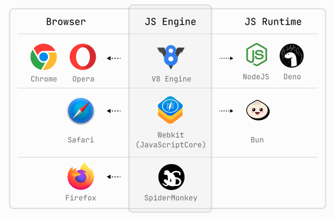

## 브라우저와 자바스크립트 엔진

1. 주요 브라우저 종류  
  Google Chrome, Apple Safari, Firefox, Opera, Microsoft Edge, Naver Whale

2. 브라우저마다 다른 자바스크립트 엔진  
   - 각 브라우저는 고유의 JavaScript 엔진을 사용해 **웹 표준**을 준수하고, 성능을 최적화하고 특정 기능 구현에 다른 접근 방식과 장점을 가지고 있고 스크립트를 처리하는 자체적인 자바스크립트 엔진이 있습니다.  
 
   > - 브라우저 엔진 동작 순서  
   >    1. 브라우저 엔진이 스크립트를 읽고 이해합니다.  
   >    2. 읽은 스크립트를 컴퓨터가 이해할 수 있는 기계어로 전환합니다.  
   >    3. 컴파일된 기계어 코드가 실행되어 스크립트의 명령이 수행됩니다.

   - Google Chrome과 Opera 브라우저는 [V8](https://v8.dev/) 엔진을 사용합니다. V8은 Google이 개발한 고성능 JavaScript 엔진으로, 웹 애플리케이션의 속도를 향상시키기 위해 최적화되어 있습니다. Node.js에서도 이 엔진을 사용합니다.
   - Safari 브라우저는 [Webkit](https://developer.mozilla.org/ko/docs/Glossary/WebKit)의 일부로 JavaScriptCore (JSC)라는 엔진을 사용합니다. WebKit은 Apple이 개발한 브라우저 엔진으로, JSC는 그 내부에 JavaScript를 처리하는 부분입니다.
   - Firefox는 [SpiderMonkey](https://spidermonkey.dev/) 엔진을 사용하며 Mozilla Foundation에 의해 개발되었습니다. JavaScript의 성능 및 표준 준수에 초점을 맞추고 있습니다.
